# :pencil2: pqLAB

O pqLAB é uma ferramenta web de organização de pesquisa qualitativa que centraliza em uma única interface seis instrumentos de trabalho acadêmico: diário de campo, listas, tarefas, favoritos, fichamentos e planos de curso, todos conectados por [[links internos]] navegáveis. Os dados são armazenados diretamente no repositório GitHub privado do próprio usuário, sem servidor intermediário, e uma visualização em grafo revela automaticamente as conexões temáticas entre o material registrado, formando um mapa mental, capaz de fornecer *insights* sobre sua própria investigação.

O software foi desenvolvido por [Viktor Chagas](https://scholar.google.com/citations?user=F02DKoAAAAAJ&hl=en) e pelo [coLAB/UFF](http://colab-uff.github.io), com auxílio do Claude Code Sonnet 4.6 para as tarefas de programação. Os autores agradecem a Rafael Cardoso Sampaio pelos comentários e sugestões de adoção de ferramentas de IA, que levaram ao planejamento inicial da aplicação.

# :octocat: Frameworks

O pqLAB foi desenvolvido em TypeScript com React 19 como framework de interface, utilizando Vite 7 como bundler e servidor de desenvolvimento. A estilização é feita com Tailwind CSS v4 (via plugin oficial para Vite). Para roteamento foi utilizado React Router v7 com rotas aninhadas, e o gerenciamento de dados assíncronos é feito com TanStack Query v5. Os componentes de interface seguem o padrão shadcn/ui, construídos sobre primitivos Radix UI com utilitários cva, clsx e tailwind-merge. Recursos adicionais incluem @hello-pangea/dnd para drag-and-drop no kanban, Recharts para gráficos, jsPDF + jspdf-autotable para exportação em PDF, xlsx para planilhas e js-yaml para serialização dos dados e SVG puro para o grafo, além de opcionalmente integrar com Firebase.

Toda a persistência de dados ocorre diretamente no repositório GitHub do usuário por meio da GitHub Contents API (REST), sem banco de dados externo. Os dados são armazenados em arquivos YAML e anexos em base64, organizados por entidade no repositório. O projeto não depende de nenhum serviço de backend próprio — o navegador se comunica diretamente com as APIs do GitHub e do Firebase.

# 🚀 Instalação do pqLAB — Passo a passo

> Toda a configuração é feita pelo navegador e pela interface do GitHub.
> Nenhum terminal, nenhum build local — o GitHub cuida de tudo automaticamente.

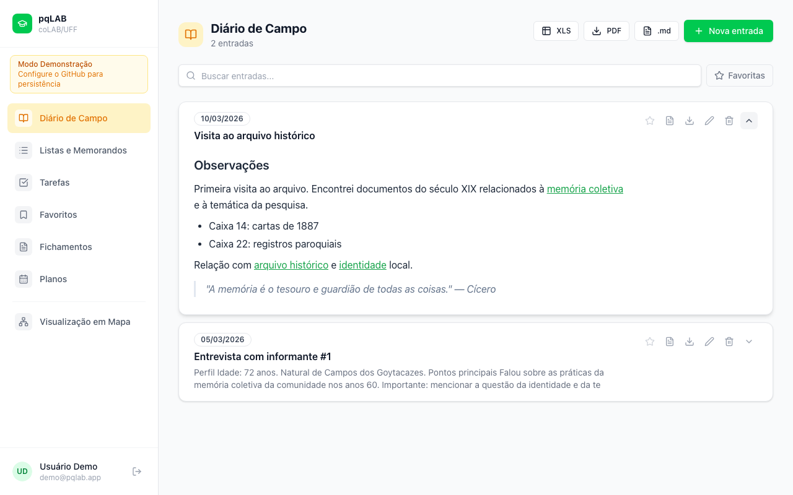

---

## Passo 1 — Fork do repositório no GitHub

1. Acesse [github.com](https://github.com) com sua conta
2. Vá ao repositório do pqLAB e clique em **Fork** (ou suba os arquivos em um repositório novo)
3. O repositório pode ser **público ou privado**

---

## Passo 2 — Ativar o GitHub Pages

1. No repositório forkado: **Settings → Pages**
2. Em "Source", selecione **GitHub Actions**
3. Salve — nada mais a fazer aqui

---

## Passo 3 — Criar um repositório de dados no GitHub

1. Crie um segundo repositório **privado** (ex: `meus-dados-pq`) — é onde os seus dados YAML serão salvos
2. Não precisa de nenhum arquivo dentro, pode ficar vazio

---

## Passo 4 — Obter um PAT do GitHub (feito pelo navegador)

1. GitHub → **Settings → Developer settings → Personal access tokens → Tokens (classic)**
2. Clique **Generate new token**
3. Marque o escopo **`repo`**
4. Gere e copie o token — você vai colá-lo no app mais tarde

---

## Passo 5A — (Opcional) Configurar login com Google

Se quiser o botão "Entrar com Google", edite o arquivo `public/config.json` direto no GitHub
(clique no arquivo → ícone de lápis ✏️):

```json
{
  "_instrucoes": "Preencha os campos abaixo com as credenciais do seu projeto Firebase",
  "firebase": {
    "apiKey": "AIza...",
    "authDomain": "seu-projeto.firebaseapp.com",
    "projectId": "seu-projeto",
    "storageBucket": "seu-projeto.firebasestorage.app",
    "messagingSenderId": "123456789",
    "appId": "1:123:web:abc..."
  }
}
```

### Para criar o projeto Firebase:

1. Acesse [console.firebase.google.com](https://console.firebase.google.com) → **Criar projeto**
2. **Authentication → Sign-in method → Google → Ativar**
3. **Project settings → Your apps → Web app** (ícone `</>`) → copie o `firebaseConfig`
4. Em **Authentication → Settings → Authorized domains** → adicione `SEU-USUARIO.github.io`

> Se não quiser Google Auth, deixe o `config.json` com os campos em branco — o app funcionará com PAT + GitHub direto.

---

## Passo 5B — (Opcional) Criar o OAuth App no GitHub

1. Acesse github.com → Settings → Developer settings → OAuth Apps → New OAuth App

2. Preencha:

Application name: pqLAB (ou outro nome)
Homepage URL: URL do seu app (ex: https://pqlab.ombudsmanviktor.me)
Authorization callback URL: pode deixar a mesma URL do Homepage — não é usada no Device Flow

3. Clique em Register application

Na tela do app criado, role até Device Authorization e ative o toggle "Enable Device Flow"
Copie o Client ID exibido (começa com Iv1.)
⚠️ Não é necessário gerar Client Secret — o Device Flow para apps públicos usa apenas o Client ID.

### Configurar o config.json

No arquivo public/config.json do repositório da aplicação, preencha o campo clientId:

{
  "github_oauth": {
    "clientId": "Iv1.xxxxxxxxxxxxxxxxx"
  }
}

Após salvar e republicar o app, o botão "Entrar com GitHub" aparecerá automaticamente na tela de login.

Como funciona para o usuário:

1. Clica em Entrar com GitHub
2. O app exibe um código curto (ex: ABCD-1234)
3. O usuário acessa github.com/login/device em qualquer browser, digita o código e clica em Authorize
4. O app recebe o token automaticamente — sem digitar PAT
5. Na primeira vez, informa o repositório de dados (owner/repo); nas próximas, entra direto

### Mantendo o login com PAT

Se preferir não configurar o OAuth (deixar clientId em branco), a tela de login mostrará apenas o formulário PAT — o comportamento atual, sem alterações. Quando o OAuth está ativo, o formulário PAT continua acessível via toggle "Configurar com PAT" na tela de login.


## Passo 6 — Fazer o deploy (automático)

Qualquer commit/push na branch `main` do repositório dispara o **GitHub Actions** automaticamente, que:

1. Instala as dependências (`npm ci`)
2. Compila o projeto (`npm run build`)
3. Publica no GitHub Pages

O primeiro deploy demora ~2 minutos. Você pode acompanhar em:
**Actions → Build e Deploy no GitHub Pages**

---

## Passo 7 — Primeiro acesso ao site

1. Acesse: `https://SEU-USUARIO.github.io/NOME-DO-REPO/`
2. Se configurou Firebase: clique **Entrar com Google**
3. Se não configurou: use o formulário de PAT direto
4. Preencha:
   - **PAT**: o token gerado no Passo 4
   - **Usuário/Org**: seu usuário GitHub
   - **Repositório**: `meus-dados-pq` (criado no Passo 3)
5. Clique **Conectar e entrar** — pronto! ✅

> Os dados são salvos como arquivos YAML no seu repositório privado.
> Cada usuário que logar com uma conta Google diferente terá acesso apenas aos seus próprios dados.

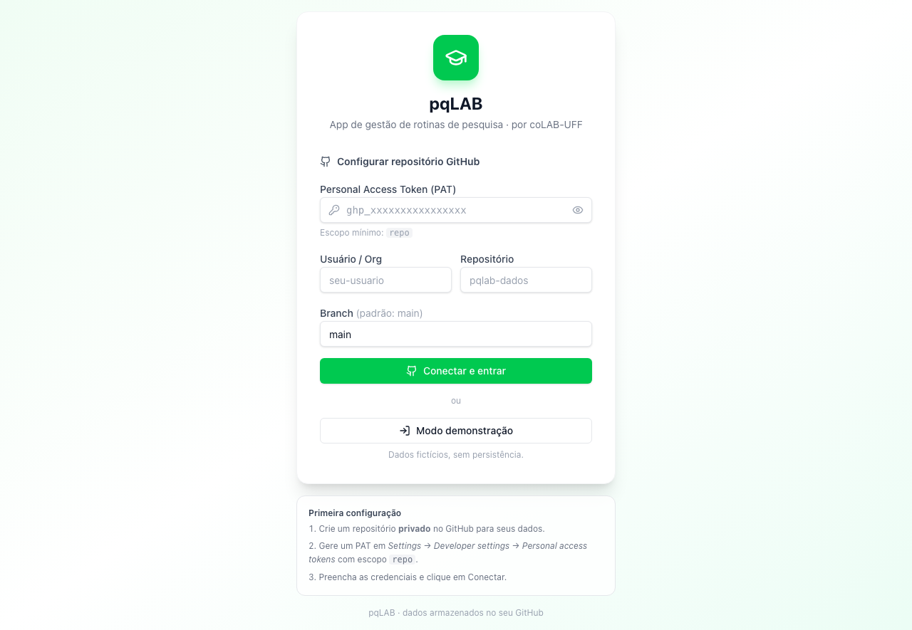

---

## Módulos

### 1. Diário de Campo

Registre, em entradas cronológicas, como um diário de campo, os principais encontros e acontecimentos relacionados à sua pesquisa. O módulo permite documentar momentos importantes de sua investigação, criando [[links internos]] para associar episódios ou sujeitos, e etiquetas para classificar temas. O compilado de todos os registros ou as entradas do diário individualmente podem ser exportados em diferentes formatos e o usuário pode ainda favoritar suas anotações mais importantes.

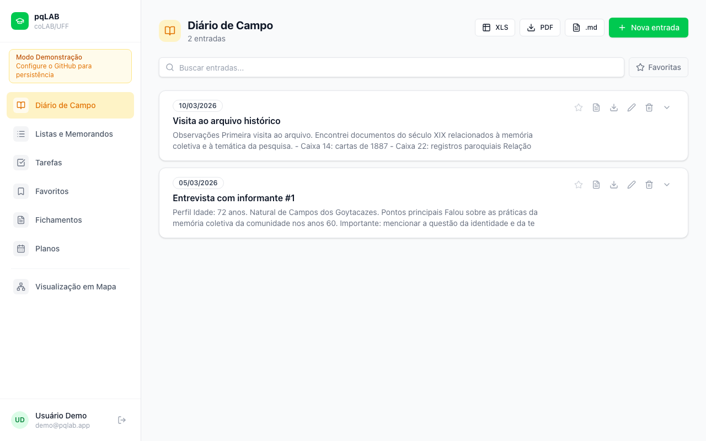


### 2. Listas e Memorandos

Organize listas e memorandos livremente. Se sua pesquisa é ancorada em fichas ou anotações de campo esparsas, que funcionam como memorandos, conforme o jargão empregado na *Grounded Theory*, este módulo pode lhe ajudar a dar conta de visualizar padrões e reconhecer tendências de forma exploratória. Também permite organizar um sumário de capítulos para seu livro, tese ou dissertação.

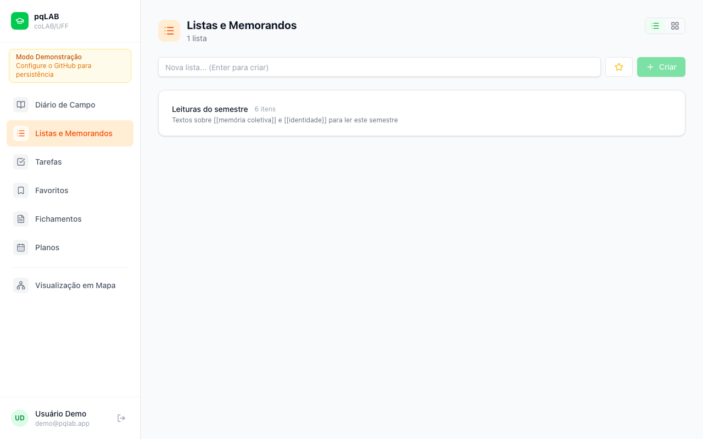

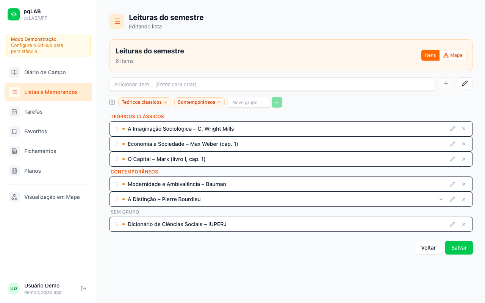


### 3. Tarefas

Gerencie as principais tarefas relacionadas à sua pesquisa, incluindo metas abrangentes, compromissos específicos e prazos. O módulo apresenta ainda uma visualização para acompanhamento do progresso de suas atividades.

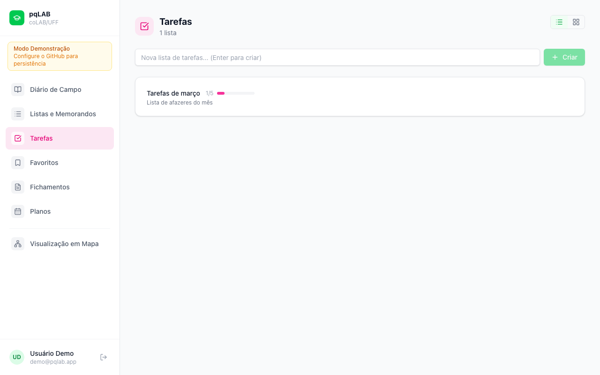

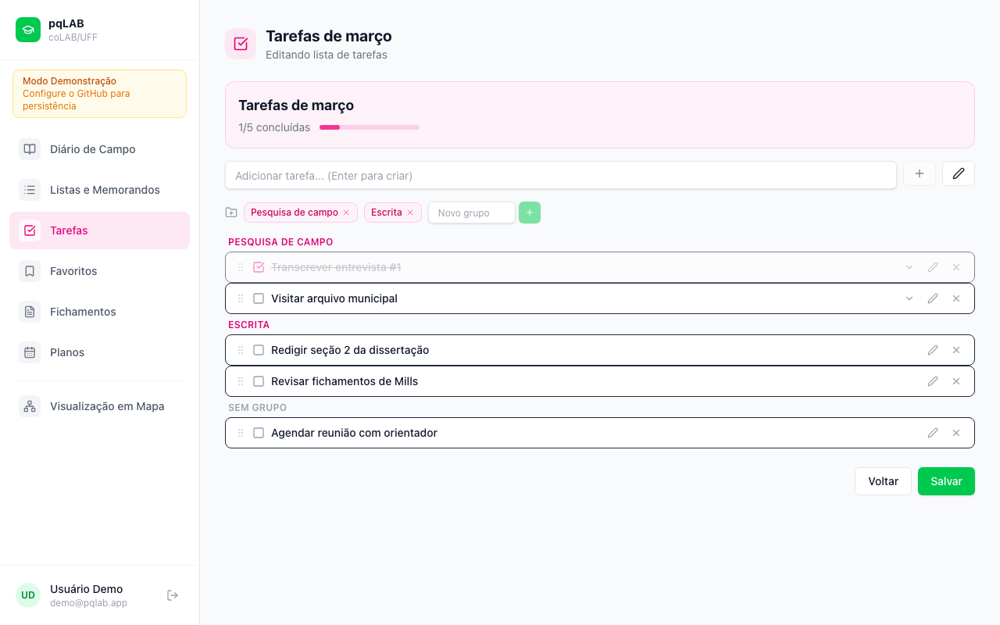


### 4. Favoritos

Guarde links, artigos e documentos em arquivos importantes, salvando todos os favoritos de sua pesquisa em um só local. O módulo permite trabalhar tanto com URLs quanto com arquivos como PDF, ePUB e DOC, importando automaticamente os metadados dos documentos anexados. Há ainda opção para assinar o feed RSS de blogs e portais importantes para sua pesquisa.

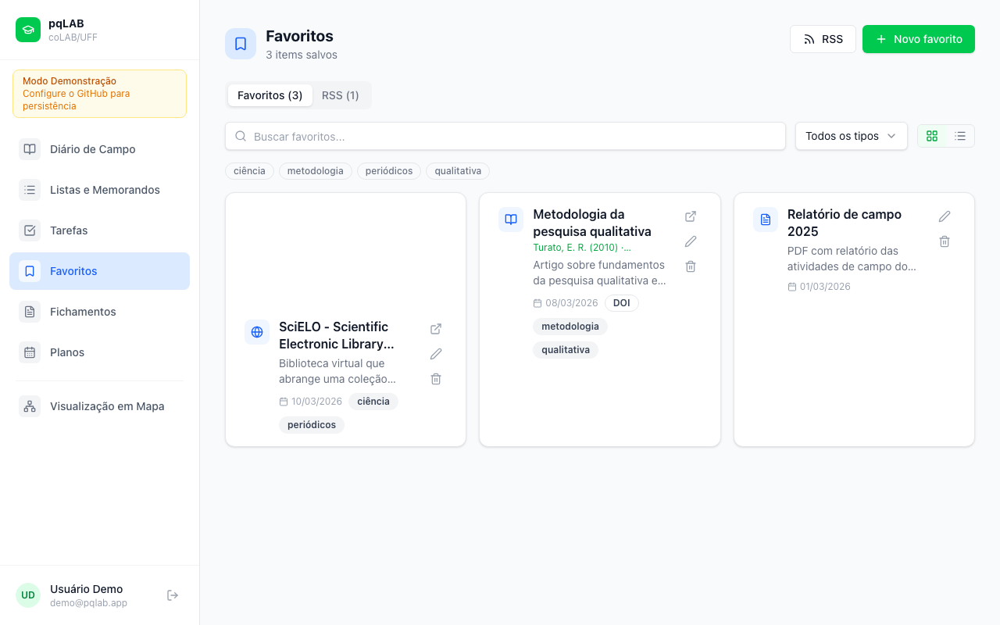

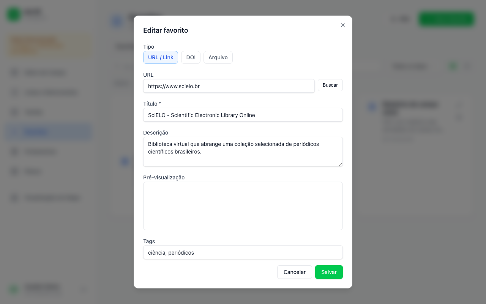


### 5. Fichamentos

Construa fichamentos sobre referências bibliográficas e leituras importantes para sua pesquisa. O módulo organiza e documenta suas leituras em diferentes padrões de normatização (ABNT/APA) e permite ainda inserir comentários e citações página a página, além de facilitar a exportação do fichamento em diferentes formatos de arquivo.

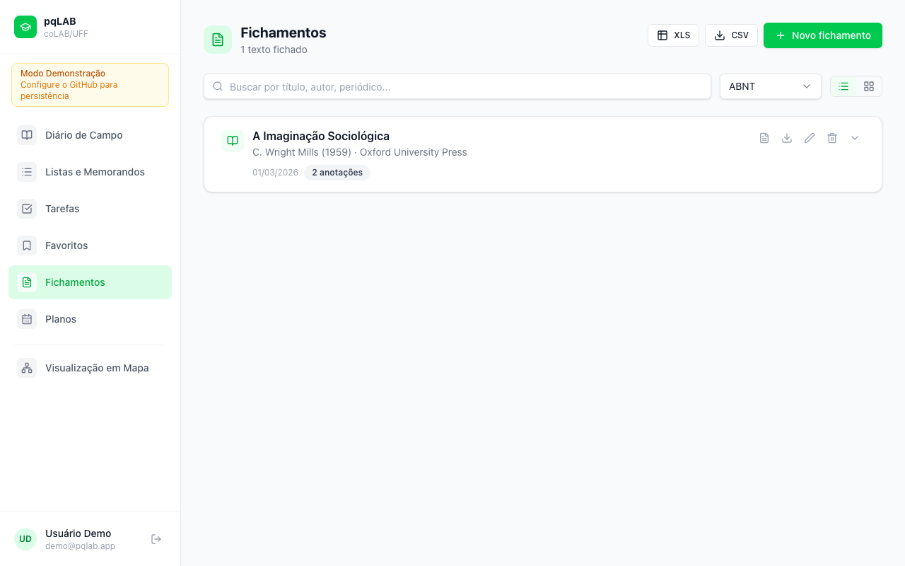

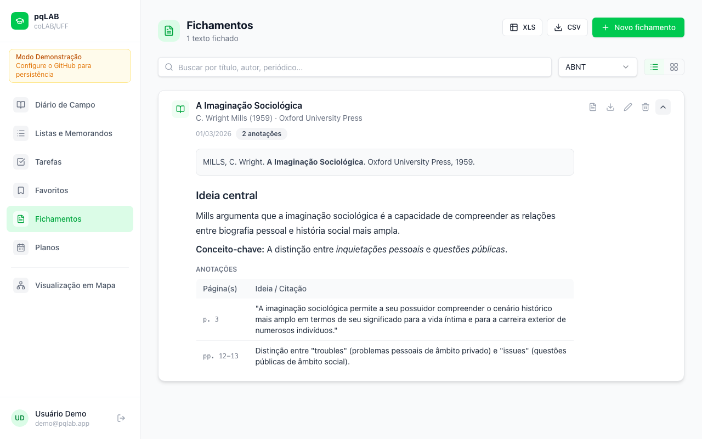


### 6. Planos

Cadastre planos de trabalho ou programas de disciplinas, associando a descrição de atividades e recomendações de leitura a datas específicas e organizando por temas, em um sistema simples de *drag and drop*. Os planos podem ser ainda exportados em diferentes formatos para fácil compartilhamento.

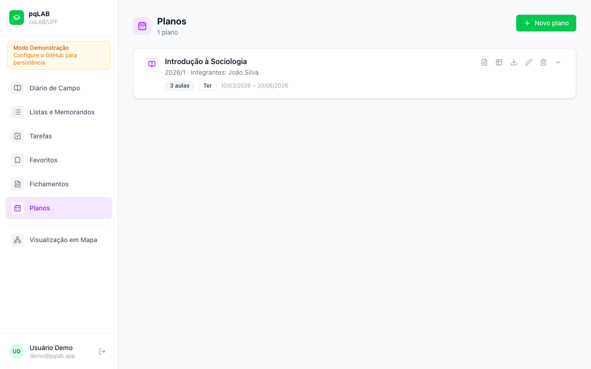

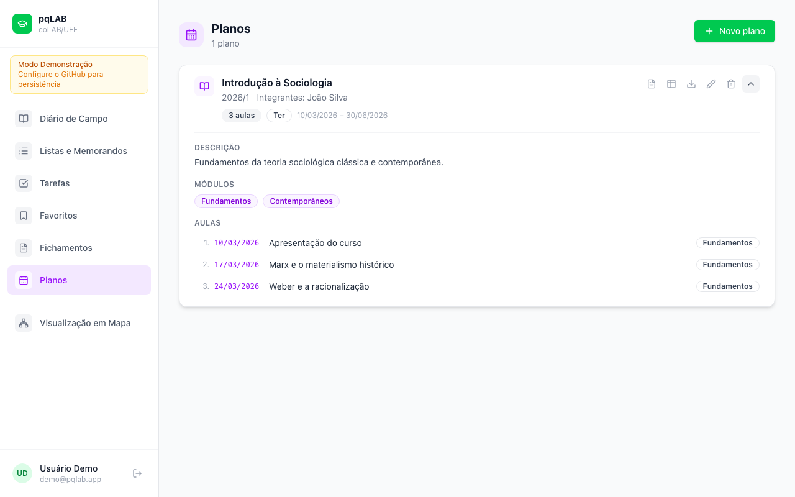


### 7. Visualização em Mapa

Acompanhe e visualize as associações construídas a partir de [[links internos]] nas suas anotações de diário de campo, tarefas, fichamentos e outros módulos em um mapa mental interativo, produzido a partir de um grafo *force-directed* gerado automaticamente com os dados providos pelos módulos.

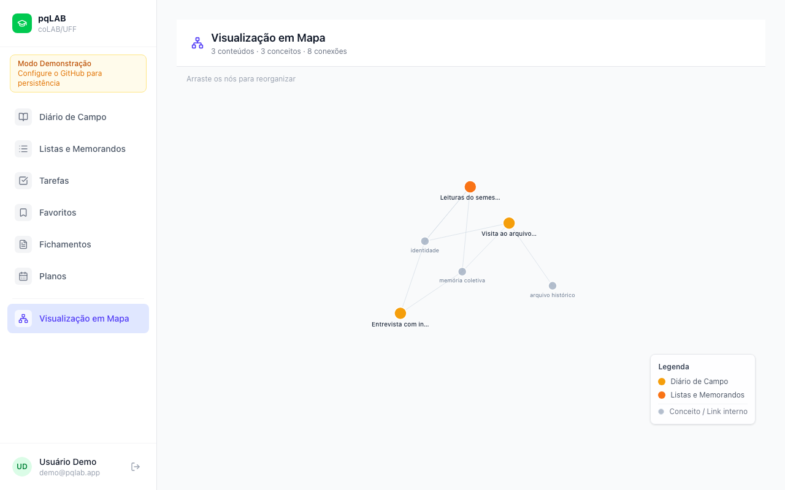

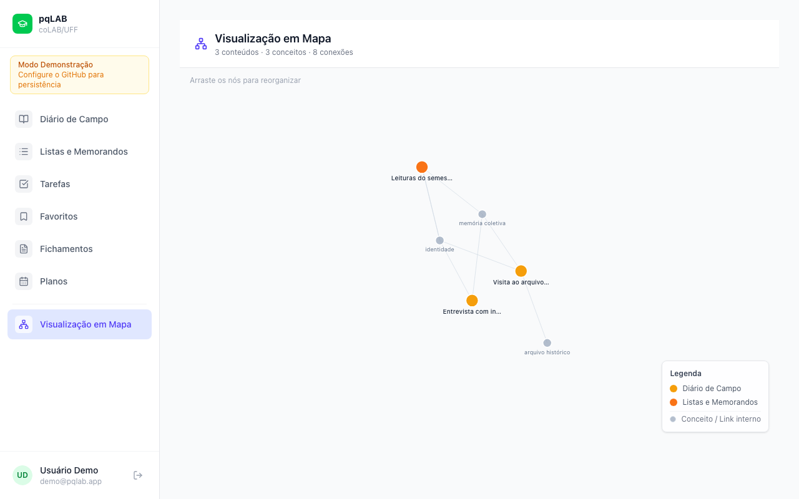


---

## Estrutura de dados criada automaticamente

```
meus-dados-pq/
│
├── data/
│   ├── diario/
│   │   ├── {uuid}.yaml        ← uma entrada por arquivo
│   │   └── {uuid}.yaml
│   │
│   ├── bookmarks/
│   │   └── {uuid}.yaml
│   │
│   ├── rssfeeds/
│   │   └── {uuid}.yaml
│   │
│   ├── fichamentos/
│   │   └── {uuid}.yaml
│   │
│   ├── planos/
│   │   └── {uuid}.yaml
│   │
│   ├── listas/                ← Tarefas (com checkbox)
│   │   └── {uuid}.yaml
│   │
│   └── listassimples/         ← Listas e Memorandos (sem checkbox)
│       └── {uuid}.yaml
│
└── attachments/
    ├── diario/{id}/{arquivo}   ← PDFs, imagens etc. por módulo
    ├── bookmarks/{id}/{arquivo}
    └── fichamentos/{id}/{arquivo}
```


---

## Modos de operação

| Modo | Quando ocorre | Persistência |
|------|--------------|--------------|
| **Demo** | Sem PAT configurado, clica "Modo Demonstração" | ❌ Dados fictícios, sem salvar |
| **GitHub** | PAT + repositório configurados | ✅ YAML no repositório privado |
| **Google + GitHub** | Firebase configurado + PAT configurado | ✅ Dados isolados por usuário Google |
| **GitHub OAuth** | GitHub OAuth App + PAT configurado | ✅ Dados isolados por usuário GitHub |

---

*pqLAB — Gestão de rotinas de pesquisa · um projeto desenvolvido por [coLAB/UFF](https://colab-uff.github.io/)*
